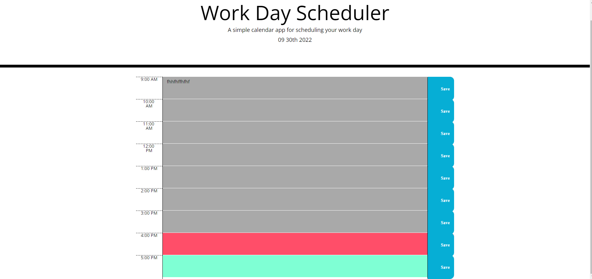

# Calender

## Description

This project is meant to create a schedule for a busy person. It shows the current time and allows for the high-lighted time to be display. From this code I learned how to use time management styles in JavaScript and how to save notes to the local memory .

## Installation

The installation of this project requires going to the following website: https://hoeferg.github.io/calender/

## Usage

When you open the website, put your schedule in the box and hit save. When that time comes, the section for that time will be red. If the time is in the future, the section with that time will be blue. If the time is in the past, the color of the section will be gray. The calender that you make will be saved till the next time you come visit.

## Credits

N/A

## License

N/a
---
