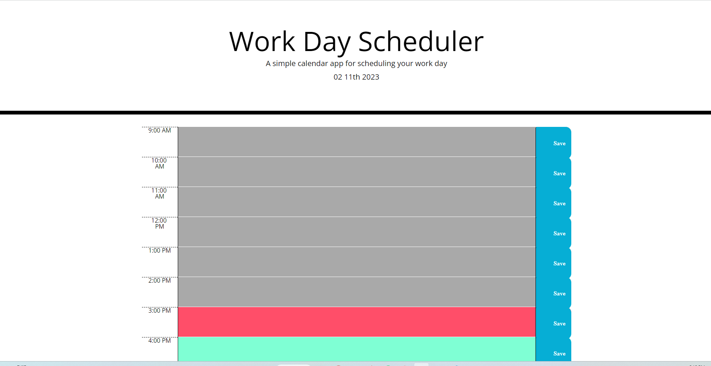

<!-- Improved compatibility of back to top link: See: https://github.com/othneildrew/Best-README-Template/pull/73 -->
<a name="readme-top"></a>
<!--
*** Thanks for checking out the Best-README-Template. If you have a suggestion
*** that would make this better, please fork the repo and create a pull request
*** or simply open an issue with the tag "enhancement".
*** Don't forget to give the project a star!
*** Thanks again! Now go create something AMAZING! :D
-->


<!-- PROJECT SHIELDS -->
<!--
*** I'm using markdown "reference style" links for readability.
*** Reference links are enclosed in brackets [ ] instead of parentheses ( ).
*** See the bottom of this document for the declaration of the reference variables
*** for contributors-url, forks-url, etc. This is an optional, concise syntax you may use.
*** https://www.markdownguide.org/basic-syntax/#reference-style-links


<!-- PROJECT LOGO -->
<br />
<div align="center">
  <a href="https://github.com/hoeferg/calendar">
    
  </a>

<h3 align="center">Calender</h3>

  <p align="center">
    This project is meant to create a schedule for a busy person. It shows the current time and allows for the high-lighted time to be display. From this code I learned how to use time management styles in JavaScript and how to save notes to the local memory.
    <br />
    <a href="https://github.com/hoeferg/calendar"><strong>Explore the docs »</strong></a>
    <br />
    <br />
    <a href="https://github.com/hoeferg/calendar">View Demo</a>
    ·
    <a href="https://github.com/hoeferg/calendar/issues">Report Bug</a>
    ·
    <a href="https://github.com/hoeferg/calendar/issues">Request Feature</a>
  </p>
</div>


<!-- TABLE OF CONTENTS -->
<details>
  <summary>Table of Contents</summary>
  <ol>
    <li>
      <a href="#about-the-project">About The Project</a>
      <ul>
        <li><a href="#built-with">Built With</a></li>
      </ul>
    </li>
    <li>
      <a href="#getting-started">Getting Started</a>
      <ul>
        <li><a href="#prerequisites">Prerequisites</a></li>
        <li><a href="#installation">Installation</a></li>
      </ul>
    </li>
    <li><a href="#usage">Usage</a></li>
    <li><a href="#contributing">Contributing</a></li>
    <li><a href="#license">License</a></li>
    <li><a href="#contact">Contact</a></li>
    <li><a href="#acknowledgments">Acknowledgments</a></li>
  </ol>
</details>


<!-- ABOUT THE PROJECT -->
## About The Project

[![Product Name Screen Shot][product-screenshot]](https://example.com)

Here's a blank template to get started: To avoid retyping too much info. Do a search and replace with your text editor for the following: `/hoeferg`, `calendar`, `linkedin_username`, `gmail`, `gaylehoefer`, `Calender`, `This project is meant to create a schedule for a busy person. It shows the current time and allows for the high-lighted time to be display. From this code I learned how to use time management styles in JavaScript and how to save notes to the local memory.`

<p align="right">(<a href="#readme-top">back to top</a>)</p>


### Built With

* [![JQuery][JQuery.com]][JQuery-url]

<p align="right">(<a href="#readme-top">back to top</a>)</p>


<!-- GETTING STARTED -->
## Getting Started

To start the project go to https://hoeferg.github.io/calender/

### Prerequisites

There are no prerequisites for the program.

### Installation

The installation of this project requires going to the following website: https://hoeferg.github.io/calender/

   ```

<p align="right">(<a href="#readme-top">back to top</a>)</p>


<!-- USAGE EXAMPLES -->
## Usage

When you open the website, put your schedule in the box and hit save. When that time comes, the section for that time will be red. If the time is in the future, the section with that time will be blue. If the time is in the past, the color of the section will be gray. The calender that you make will be saved till the next time you come visit


<p align="right">(<a href="#readme-top">back to top</a>)</p>


## Contributing

Gayle Hoefer was the only contributor to this website.


<!-- LICENSE -->
## License

N/A

<p align="right">(<a href="#readme-top">back to top</a>)</p>


<!-- CONTACT -->
## Contact
Gayle Hoefer - [LinkedIn](https://www.linkedin.com/in/gayle-hoefer-61a2a3124/) - [Github](https://github.com/hoeferg)

Project Link: [https://github.com/hoeferg/calendar](https://github.com/hoeferg/calendar)

<p align="right">(<a href="#readme-top">back to top</a>)</p>


<p align="right">(<a href="#readme-top">back to top</a>)</p>


<!-- MARKDOWN LINKS & IMAGES -->
<!-- https://www.markdownguide.org/basic-syntax/#reference-style-links -->
[contributors-shield]: https://img.shields.io/github/contributors/hoeferg/calendar.svg?style=for-the-badge
[contributors-url]: https://github.com/hoeferg/calendar/graphs/contributors
[forks-shield]: https://img.shields.io/github/forks/hoeferg/calendar.svg?style=for-the-badge
[forks-url]: https://github.com/hoeferg/calendar/network/members
[stars-shield]: https://img.shields.io/github/stars/hoeferg/calendar.svg?style=for-the-badge
[stars-url]: https://github.com/hoeferg/calendar/stargazers
[issues-shield]: https://img.shields.io/github/issues/hoeferg/calendar.svg?style=for-the-badge
[issues-url]: https://github.com/hoeferg/calendar/issues
[license-shield]: https://img.shields.io/github/license/hoeferg/calendar.svg?style=for-the-badge
[license-url]: https://github.com/hoeferg/calendar/blob/master/LICENSE.txt
[linkedin-shield]: https://img.shields.io/badge/-LinkedIn-black.svg?style=for-the-badge&logo=linkedin&colorB=555
[linkedin-url]: https://linkedin.com/in/gayle-hoefer-61a2a3124/
[product-screenshot]: images/screenshot.png
[Next.js]: https://img.shields.io/badge/next.js-000000?style=for-the-badge&logo=nextdotjs&logoColor=white
[Next-url]: https://nextjs.org/
[React.js]: https://img.shields.io/badge/React-20232A?style=for-the-badge&logo=react&logoColor=61DAFB
[React-url]: https://reactjs.org/
[Vue.js]: https://img.shields.io/badge/Vue.js-35495E?style=for-the-badge&logo=vuedotjs&logoColor=4FC08D
[Vue-url]: https://vuejs.org/
[Angular.io]: https://img.shields.io/badge/Angular-DD0031?style=for-the-badge&logo=angular&logoColor=white
[Angular-url]: https://angular.io/
[Svelte.dev]: https://img.shields.io/badge/Svelte-4A4A55?style=for-the-badge&logo=svelte&logoColor=FF3E00
[Svelte-url]: https://svelte.dev/
[Laravel.com]: https://img.shields.io/badge/Laravel-FF2D20?style=for-the-badge&logo=laravel&logoColor=white
[Laravel-url]: https://laravel.com
[Bootstrap.com]: https://img.shields.io/badge/Bootstrap-563D7C?style=for-the-badge&logo=bootstrap&logoColor=white
[Bootstrap-url]: https://getbootstrap.com
[JQuery.com]: https://img.shields.io/badge/jQuery-0769AD?style=for-the-badge&logo=jquery&logoColor=white
[JQuery-url]: https://jquery.com 
